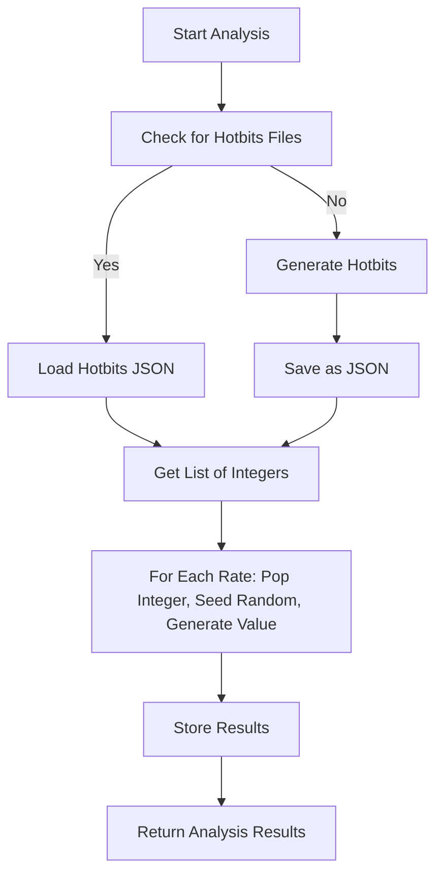
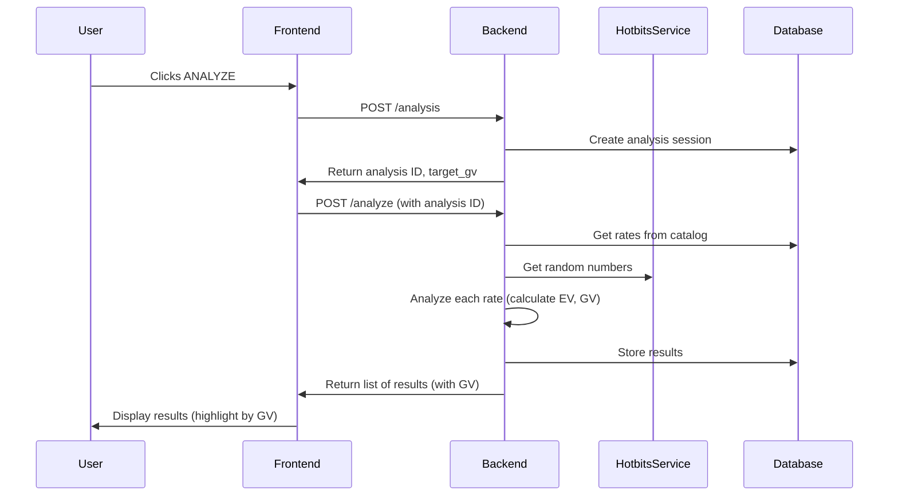

# Randomness in AetherOnePy/FinCompass: The Hotbits System

## Table of Contents
1. [Introduction](#introduction)
2. [Philosophy of Randomness in Radionics](#philosophy-of-randomness-in-radionics)
3. [What Are Hotbits?](#what-are-hotbits)
4. [Sources of Randomness](#sources-of-randomness)
5. [Generating Hotbits: Algorithms and Hardware](#generating-hotbits-algorithms-and-hardware)
6. [Storing and Managing Hotbits](#storing-and-managing-hotbits)
7. [Loading and Using Hotbits in Analysis](#loading-and-using-hotbits-in-analysis)
8. [How Hotbits Influence Analysis Results](#how-hotbits-influence-analysis-results)
9. [Code Examples](#code-examples)
10. [Process Diagrams](#process-diagrams)
11. [Practical Implications and Best Practices](#practical-implications-and-best-practices)
12. [References](#references)

---

## Introduction

Randomness is a cornerstone of the AetherOnePy/FinCompass system, providing the foundation for unbiased, energetic analysis. This document explores the design, implementation, and philosophy behind the hotbits system, which generates, stores, and utilizes true random numbers for analysis and decision-making.

---

## Philosophy of Randomness in Radionics

In radionics and related fields, randomness is not just a technical requirement—it is a philosophical one. True randomness is believed to allow for the unbiased sampling of energetic states, free from deterministic or algorithmic bias. By using physical sources of entropy (like webcams or hardware random number generators), the system aims to tap into the unpredictable, dynamic nature of reality itself.

---

## What Are Hotbits?

**Hotbits** are sequences of random numbers generated from physical processes or time-based entropy. In AetherOnePy/FinCompass, hotbits are used to:
- Seed random number generators for analysis
- Ensure each analysis is unique and unpredictable
- Simulate the "energetic variability" central to radionics

Hotbits are stored as lists of integers in JSON files, and are consumed as needed during analysis.

---

## Sources of Randomness

The system supports multiple sources for generating hotbits:

- **Webcam:** Uses unpredictable pixel changes and noise from a webcam.
- **Raspberry Pi:** Utilizes hardware-based random number generation.
- **Time-Loop Algorithm:** Uses timing differences in code execution as a fallback entropy source.

---

## Generating Hotbits: Algorithms and Hardware

### 1. Webcam-Based Randomness
- Captures frames from a webcam.
- Analyzes pixel noise and changes to extract entropy.
- Converts this entropy into random integers.

### 2. Raspberry Pi Hardware RNG
- Uses the Pi's built-in hardware random number generator.
- Provides high-quality, unpredictable random numbers.

### 3. Time-Loop Algorithm (Fallback)
- Runs two identical code loops and measures their execution time.
- If the first loop is faster, records a `1`; otherwise, a `0`.
- Repeats to build a sequence of bits, then converts to an integer.

**Example:**
```python
bits = []
while len(bits) < 32:
    t1 = time.perf_counter(); [random.randint(1,10) for _ in range(50)]; t2 = time.perf_counter()
    t3 = time.perf_counter(); [random.randint(1,10) for _ in range(50)]; t4 = time.perf_counter()
    bits.append(1 if (t2-t1) < (t4-t3) else 0)
random_integer = int(''.join(map(str, bits)), 2)
```

---

## Storing and Managing Hotbits

- Hotbits are saved as JSON files (e.g., `hotbits_123456789.json`) in a designated folder.
- Each file contains a list of random integers and metadata about the source.
- Files are deleted after use to ensure each set of hotbits is only used once.

**Example JSON:**
```json
{
  "integerList": [123456, 789012, ...],
  "source": "timeLoop"
}
```

---

## Loading and Using Hotbits in Analysis

1. **Load a hotbits file:**
   - Randomly select a JSON file from the hotbits folder.
   - Load the list of integers.
   - Delete the file after loading.
2. **Use hotbits for randomness:**
   - For each random value needed, pop an integer from the list.
   - Seed Python's random generator with this integer.
   - Generate the required random value (e.g., for energetic value, GV).

**Example:**
```python
if len(hotbits) > 0:
    random.seed(hotbits.pop(0))
    value = random.randint(0, 1000)
else:
    value = random.randint(0, 1000)  # fallback
```

---

## How Hotbits Influence Analysis Results

- Each rate/signature in the analysis receives a unique, hotbit-seeded random value.
- This value is used to calculate energetic value (EV) and general vitality (GV).
- Ensures that each analysis is unique, unbiased, and unpredictable.

---

## Code Examples

### Generating and Saving Hotbits
```python
def generate_and_save_hotbits(folder_path, count=250):
    hotbits_list = [generate_random_integer() for _ in range(count)]
    filename = f"{folder_path}/hotbits_{int(time.time()*1000)}.json"
    with open(filename, 'w') as f:
        json.dump({"integerList": hotbits_list, "source": "timeLoop"}, f)
```

### Loading Hotbits
```python
def load_hotbits(folder_path):
    import os, json, random
    json_files = [f for f in os.listdir(folder_path) if f.endswith('.json')]
    random_file = random.choice(json_files)
    with open(os.path.join(folder_path, random_file), 'r') as f:
        data = json.load(f)
    os.remove(os.path.join(folder_path, random_file))
    return data["integerList"]
```

### Using Hotbits in Analysis
```python
def analyze_rates(rates, hotbits):
    results = []
    for rate in rates:
        if len(hotbits) > 0:
            random.seed(hotbits.pop(0))
        gv = random.randint(300, 1200)
        results.append({"rate": rate, "gv": gv})
    return results
```

---

## Process Diagrams

### Hotbits Generation and Use (Mermaid)


### Data Flow: Hotbits in Analysis


---

## Practical Implications and Best Practices

- **Uniqueness:** Each analysis is unique due to the one-time use of hotbits.
- **Security:** Deleting hotbits files after use prevents reuse and ensures unpredictability.
- **Fallbacks:** If no hardware entropy is available, the time-loop method provides a reasonable fallback.
- **Transparency:** Hotbits files can be inspected for auditing and verification.
- **Performance:** Generating hotbits can be resource-intensive; pre-generate when possible.

---

## References
- [AetherOnePy Documentation](https://github.com/yourrepo/AetherOnePy)
- [Randomness in Computing (Wikipedia)](https://en.wikipedia.org/wiki/Randomness)
- [Radionics and Entropy](https://en.wikipedia.org/wiki/Radionics)
- [Python random module](https://docs.python.org/3/library/random.html) 